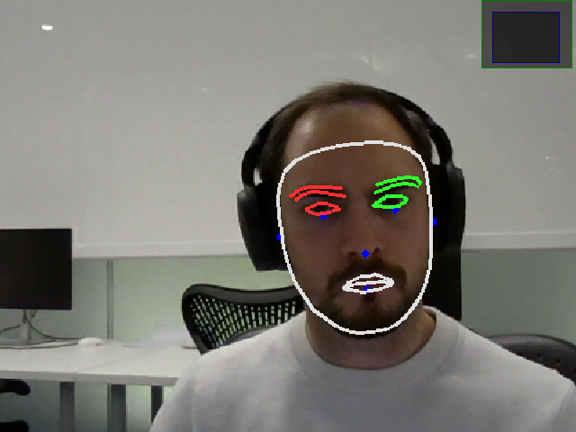

# Facial Landmarks Detection System

A high-performance Python implementation for real-time facial detection and facial landmark detection using MediaPipe and OpenCV.

## Demo



## Installation

### Prerequisites
- `uv` Python package manager
- OpenCV-compatible camera (for webcam features)

### Clone Repo and Install Dependencies

```bash
git clone https://github.com/ncguilbeault/facial-landmarks.git
cd facial-landmarks
uv sync
uv run facial-landmarks --webcam # live streaming, otherwise --image [image] for single image, --video [video] for video
```

## Usage

### CLI

```console
$ uv run facial-landmarks --help

usage: facial-landmarks [-h] (--webcam | --image IMAGE | --video VIDEO | --benchmark) [--output OUTPUT]
                        [--output-dir OUTPUT_DIR] [--max-faces MAX_FACES] [--face-confidence FACE_CONFIDENCE]
                        [--landmark-confidence LANDMARK_CONFIDENCE] [--confidence CONFIDENCE]
                        [--tracking-confidence TRACKING_CONFIDENCE] [--no-face-detection] [--no-landmarks]
                        [--no-face-boxes] [--show-face-boxes] [--no-keypoints]
                        [--landmark-subset {all,face_oval,left_eye,right_eye,left_eyebrow,right_eyebrow,nose,lips}]
                        [--no-connections] [--simple-landmarks] [--show-indices] [--parallel] [--save-video]
                        [--no-fps]

Facial Landmarks Detection System

options:
  -h, --help            show this help message and exit
  --webcam              Use webcam input
  --image IMAGE         Path to input image
  --video VIDEO         Path to input video
  --benchmark           Run performance benchmark
  --output OUTPUT       Output file path (for video processing)
  --output-dir OUTPUT_DIR
                        Output directory for results
  --max-faces MAX_FACES
                        Maximum number of faces to detect
  --face-confidence FACE_CONFIDENCE
                        Face detection confidence threshold
  --landmark-confidence LANDMARK_CONFIDENCE
                        Landmark detection confidence threshold
  --confidence CONFIDENCE
                        Detection confidence threshold (alias for face-confidence)
  --tracking-confidence TRACKING_CONFIDENCE
                        Tracking confidence threshold
  --no-face-detection   Disable face detection
  --no-landmarks        Disable landmark detection
  --no-face-boxes       Disable face bounding boxes
  --show-face-boxes     Show face bounding boxes
  --no-keypoints        Disable face keypoints
  --landmark-subset {all,face_oval,left_eye,right_eye,left_eyebrow,right_eyebrow,nose,lips}
                        Landmark subset to display
  --no-connections      Disable landmark connections
  --simple-landmarks    Use simple landmark drawing (less detailed)
  --show-indices        Show landmark indices (debug mode)
  --parallel            Enable parallel processing
  --save-video          Save video output
  --no-fps              Disable FPS display

Examples:
  # Webcam demo
  uv run facial-landmarks --webcam
  
  # Process single image
  uv run facial-landmarks --image path/to/image.jpg
  
  # Process video
  uv run facial-landmarks --video path/to/video.mp4 --output output.mp4
  
  # Benchmark performance
  uv run facial-landmarks --benchmark
  
  # Custom settings
  uv run facial-landmarks --webcam --max-faces 5 --no-landmarks
```

### Basic API Usage

```python
from facial_processor import FacialLandmarkProcessor, ProcessingConfig
import cv2

# Create processor with default settings
processor = FacialLandmarkProcessor()

# Load and process image
image = cv2.imread('your_image.jpg')
result = processor.process_image(image)

# Access results
print(f"Found {len(result.faces)} faces")
print(f"Processing time: {result.processing_time*1000:.1f}ms")

# Draw results
annotated_image = processor.draw_results(image, result)
cv2.imshow('Results', annotated_image)
cv2.waitKey(0)
```

### Advanced Configuration

```python
from facial_processor import FacialLandmarkProcessor, ProcessingConfig
from landmark_detector import LandmarkSubset

# Custom configuration
config = ProcessingConfig(
    # Face detection settings
    face_detection_confidence=0.8,
    face_model_selection=1,  # Full-range model
    
    # Landmark settings
    max_num_faces=5,
    refine_landmarks=True,
    landmark_detection_confidence=0.6,
    
    # Processing options
    enable_parallel_processing=True,
    
    # Visualization
    draw_landmarks=True,
    landmark_subset=LandmarkSubset.ALL
)

processor = FacialLandmarkProcessor(config)
```

### Real-time Video Processing

```python
# Process webcam stream
processor.process_video_stream(
    source=0,  # Webcam index
    output_path="output.mp4",  # Optional: save video
    display=True  # Show real-time display
)

# Process video file
processor.process_video_stream(
    source="input.mp4",
    output_path="processed.mp4",
    display=False  # Process without display for speed
)
```

### Facial Analysis

```python
# Get detailed facial analysis
analysis = processor.get_facial_analysis(image)

print("Face Analysis:")
for i, face_data in enumerate(analysis['faces']):
    print(f"Face {i+1}:")
    print(f"  Confidence: {face_data['confidence']:.3f}")
    print(f"  Bounding box: {face_data['bbox']}")

for i, landmark_data in enumerate(analysis['landmarks']):
    features = landmark_data['features']
    print(f"Face {i+1} Features:")
    print(f"  Left eye aspect ratio: {features['left_eye_aspect_ratio']:.3f}")
    print(f"  Right eye aspect ratio: {features['right_eye_aspect_ratio']:.3f}")
    print(f"  Mouth aspect ratio: {features['mouth_aspect_ratio']:.3f}")
    pose = features['pose']
    print(f"  Head pose - Pitch: {pose['pitch']:.1f}°, Yaw: {pose['yaw']:.1f}°, Roll: {pose['roll']:.1f}°")
```